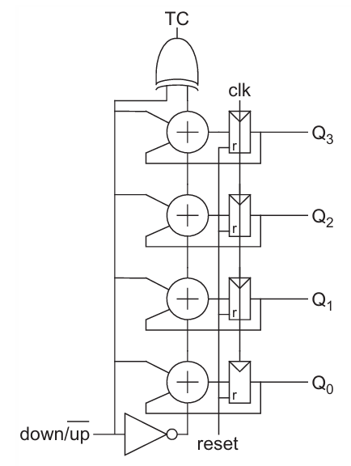
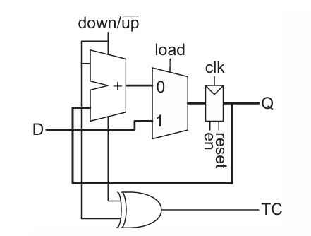
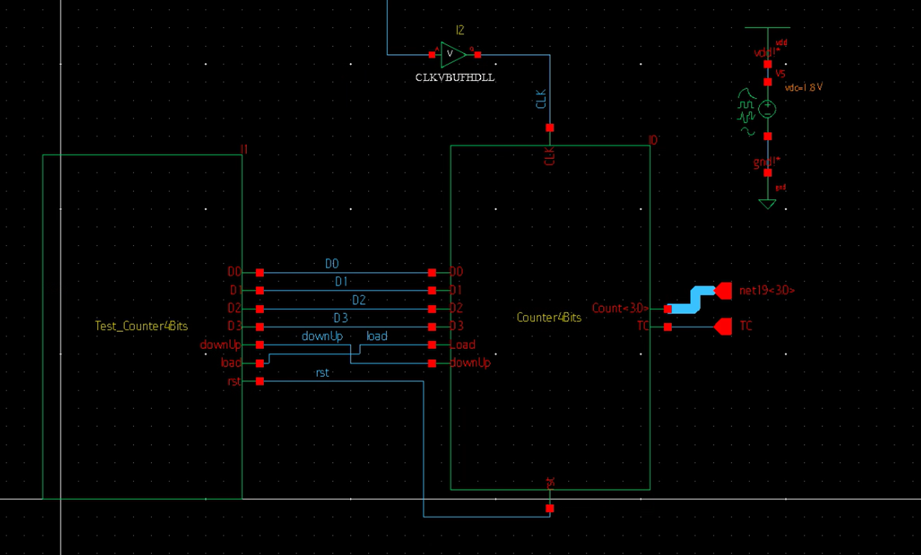
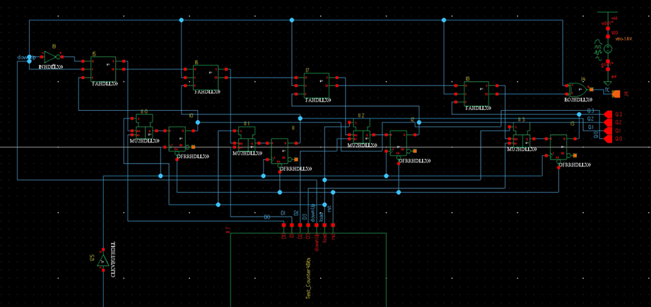
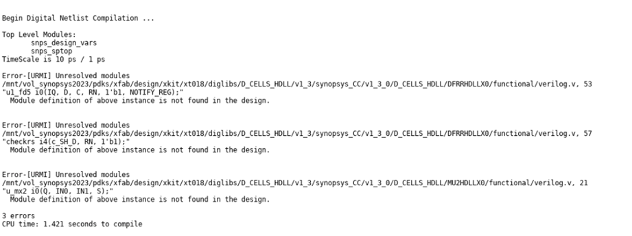

# Tarea_4_vlsi
Esteicy Jazmín Faerron Durán - Andrew José Quirós Rodríguez

## Introducción
En este proyecto se diseñará un contador arriba-abajo de 8 bits con carga
paralela, con reset asincrónico, que pueda correr al menos a 100 MHz.

## Caracterización de sumador y FF

Para esta primera parte, se obtienen los parámetros de de tiempo de propagación y consumo de potencia del sumador completo FAHDLLX0 y FF DFRRHDLLX0. El esquemático del sumador se ve de la siguiente forma:


El del FF se ve de la siguiente forma:


Una vez obtenido los esquemáticos, se debe realizar un ciruito de prueba para poder medir los tiempos de propagación del sumador.


Con este circuito, es posible observar las señales de entrada y salida del sumador.


Del cual se puede medir los tiempos de propagación tanto para la salida S como el bit de acarreo Cout respectivamente.


$t_{pd_S} = 816 ps$

$t_{pd_{Cout}} = 522 ps$

Se necesita que el tiempo de propagación de la salida Cout sea menor porque los bits más significativos dependen de este valor para sus sumas, por lo que debe terminar antes. 

Para la obtención del consumo de potencia de este componente se observa la información de la hoja de datos de la energía consumida del sumador y el FF respectivamente:


En el cual se tiene L como la carga de salida en pf. Para esta prueba se tiene una carga de salida de 5 fF, lo que da 0.005 pF. Además, como la unidad resultante es [uW/MHz], se debe multiplicar la frecuencia con la que se va a estar trabajando para finalmente obtener la potencia dinámica del sistema. La frecuencia en este caso se trata de 100 MHz.

$P_{sumador} = (0.10209+6.47991*0.005)*100*2 = 13.44*2  = 26.88 \mu W$

$P_{registro} = (0.13894+6.47978*0.005)*100 = 17.13389 \mu W$

$P_{registro8bits} = 17.13389*8 = 137.07112 \mu W$


## Trazado del sumador de 1 bit con registro

Antes de avanzar con el contador de 8 bits. Se debe hacer un trazado donde se conecte el sumador completo de 1 bit con un registro de 1 bit. El esquemático de la conexión de estos se ve de la siguiente manera:


El cual se le realiza el trazado para la extracción de capacitancias parasitarias. El trazado resultante se observa a continuación:


Para comprobar el correcto trazado del circuito, se debe hacer una prueba DRC para revisar que se cumplan todas las reglas físicas del trazado.


## Contador completo

Para el contador completo se utilizan los dos modelos anteriores, el flipflop DFRRHDLLX0 y el sumador FAHDLLX0. La referencia de un contador completo es el de las siguientes figuras:



Para implementar esto a nivel de [código](Counter4Bits/systemverilog/verilog.sv) se empieza por la definición de entradas y salidas, en este caso D0,D1,D2,D3 son las entradas de datos de un bit cada una, ya que este contador es de 4 bit, el Count es la salida de 4 bits.
```sv
module Counter4Bits (
	input CLK,
	input D0,D1,D2,D3,
	output [3:0] Count,
	input rst,
	input downUp,
	input Load,
	output TC);

wire [3:0] CI_CO;
reg TC,D0,D1,D2,D3;
reg [3:0] Data = {D0,D1,D2,D3};
```

Ahora se definen los FlipFlops, los cuales de entrada cada uno recide un bit del Data de entrada. El Data es la concatenación de D0,D1,D2 y D3, uno para cada FlipFlop. Y en la salida de cada contador se asigna un bit de del Count que es la salida. En total se deben crear 4 submodelos de estos 4 FlipFlops.

```sv
DFRRHDLLX0 FF0(
	        .C(CLK),
	        .D(Data[0]),
	        .Q(Count[0]),
	        .QN(),
		.RN(rst)
);
DFRRHDLLX0 FF1(
	        .C(CLK),
	        .D(Data[1]),
	        .Q(Count[1]),
	        .QN(),
		.RN(rst)
);
DFRRHDLLX0 FF2(
	        .C(CLK),
	        .D(Data[2]),
	        .Q(Count[2]),
	        .QN(),
		.RN(rst)
);
DFRRHDLLX0 FF3(
	        .C(CLK),
	        .D(Data[3]),
	        .Q(Count[3]),
	        .QN(),
		.RN(rst)
);
```
Por otro lado, también se definen 4 sudmodelos de los sumadores. Cada uno recibe como entrada en B un bit del Data de entrada del contador. El A recibe un bit que se es el que suma al bit B. El S es el bit del Count de salida del sumador, por esto se asigna a cada salida de un sumador un bit de la salida del contador. Cada acarreo de entrada recibe el resultado del acarreo de salida del sumador anterior, excepto el primero, ya que este recibe de entrada el Down/Up.

```sv
FAHDLLX0 Sum0(
		.B(Data[0]),
	        .A(Count[0]),
		.S(Count[0]),
		.CI(!downUp),
		.CO(CI_CO[0])
);
FAHDLLX0 Sum1(
		.B(Data[1]),
	        .A(Count[1]),
		.S(Count[1]),
		.CI(CI_CO[0]),
		.CO(CI_CO[1])
);
FAHDLLX0 Sum2(
		.B(Data[2]),
	        .A(Count[2]),
		.S(Count[2]),
		.CI(CI_CO[1]),
		.CO(CI_CO[2])
);
FAHDLLX0 Sum3(
		.B(Data[3]),
	        .A(Count[3]),
		.S(Count[3]),
		.CI(CI_CO[2]),
		.CO(CI_CO[3])
);
```

Para completar los submodelos se define el XOR que contiene el bit de acarreo, en este caso es el acarreo de salir del último sumador:

```sv
EO2HDLLX0 XOR(
		.A(downUp),
		.B(CI_CO[3]),
		.Q(TC)
);
```
Ahora se utilizan las condiciones que definen el comportamiendo de las entradas del contador, si rst está activado, la salida es cero, si está en Load la salida es el dato de entrada de 4 bits y por último sino tiene estas condiciones, el contador hacer las operaciones en base a las conexiones anteriores dando como resultado la salida de los FliFlops:
```sv
  always@(posedge CLK)
  begin
	if (rst) Count = 4'b0000;
	else if (Load) Count = Data;
	else Count = Count;
  end
endmodule
```
## TestBench

Para el [TestBench](Test_Counter4Bits/verilog/verilog.v) se utiliza también código que define qué entra al módulo del contador. Por lo que, las salidas del TestBench son los datos que entran al contador, el load y el reset. La primera se prueba el contador para arriba empezando con los datos en cero para que puedan ir incrementando. La segunda es con el contador hacia abajo empezando la cuenta en 3. La tercera es con el reset activado y el dato que tiene son todos los bits en uno para comprobar el reset. La cuarta es con el load activado con un dato de entrada de 0101. 
```sv
module Test_Counter4Bits (downUp,rst,D0,D1,D2,D3,load);
output downUp,rst,load;
output D0,D1,D2,D3;
reg downUp,rst,load;
reg D0,D1,D2,D3;
  initial begin
	D0 = 1'b0;
	D1 = 1'b0;
	D2 = 1'b0;
	D3 = 1'b0;
	downUp = 1'b1;
	rst = 1'b0;
	load = 1'b0;
	#2
	D0 = 1'b1;
	D1 = 1'b1;
	D2 = 1'b0;
	D3 = 1'b0;
	downUp = 1'b0;
	rst = 1'b0;
	load = 1'b0;
	#2
	D0 = 1'b1;
	D1 = 1'b1;
	D2 = 1'b1;
	D3 = 1'b1;
	downUp = 1'b0;
	rst = 1'b1;
	load = 1'b0;
	#2
	D0 = 1'b1;
	D1 = 1'b0;
	D2 = 1'b1;
	D3 = 1'b0;
	downUp = 1'b0;
	rst = 1'b0;
	load = 1'b1;
	$finish;
  end
endmodule
```
Ahora se puede hacer el [esquemático de ambos](Test_Tarea4/schematic/) y realizar las conexiones:



## Esquemático

Otra forma de implementarlo, es crear el [esquemático](CounterSchematic/schematic/) con los mismo módulos, el cuál queda de la siguiente forma:



Sin embargo al realizar las simulaciones de las pruebas, estas fallan porque los módulos que se llaman contienen errores, por lo que no se puede continuar con las pruebas.
