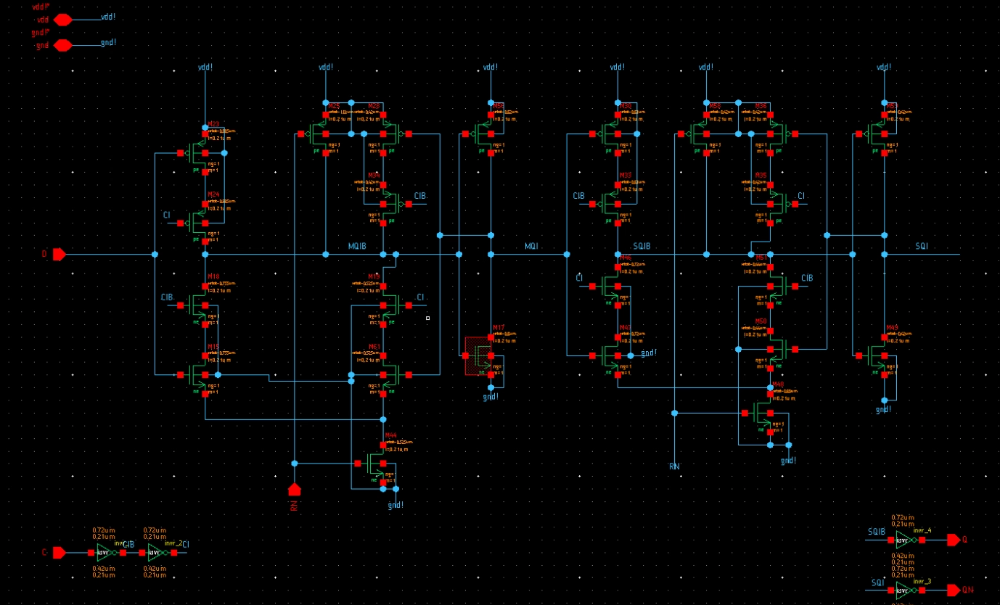
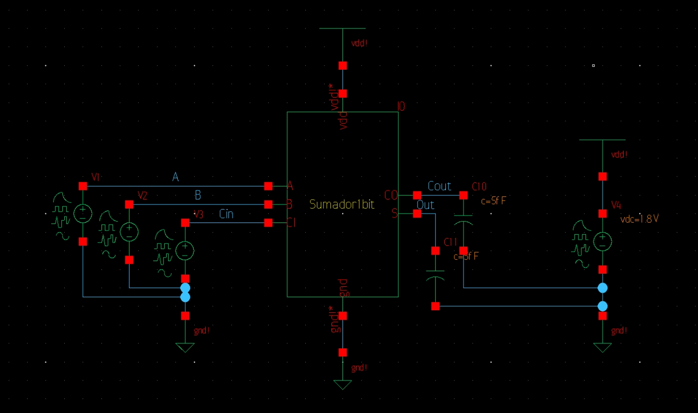
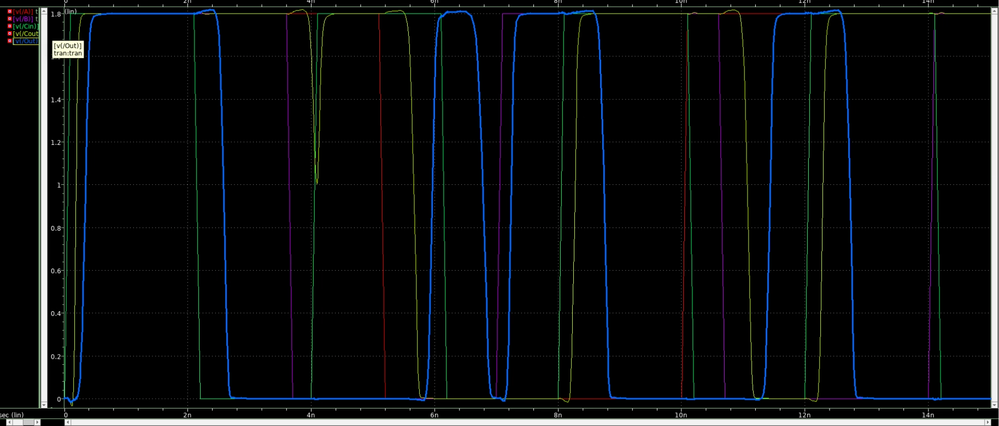
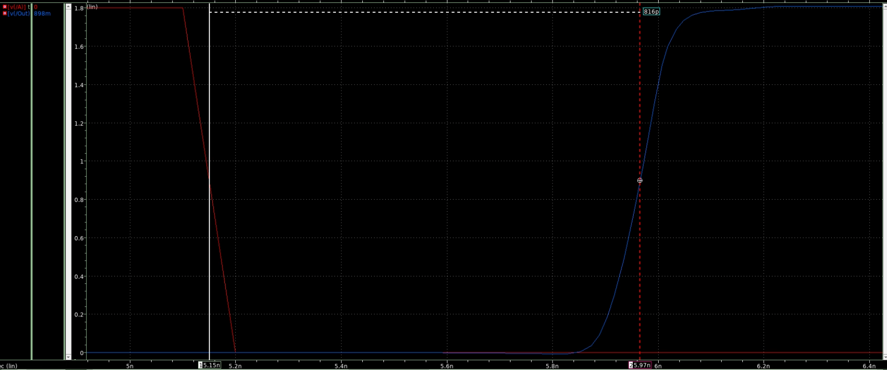
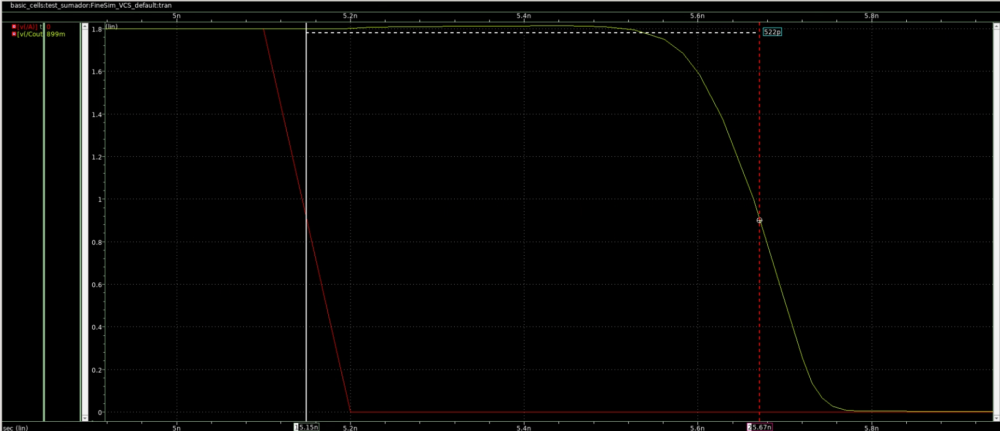
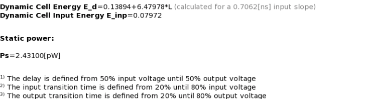
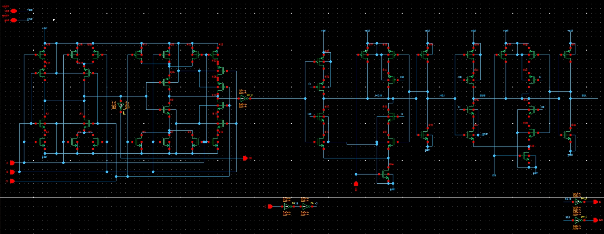
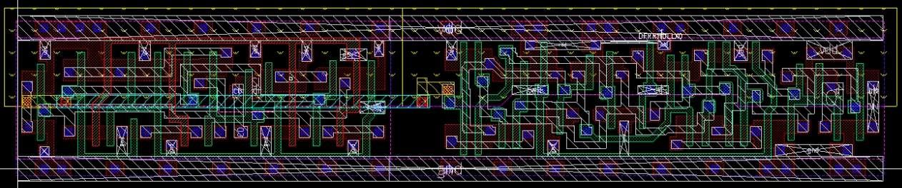
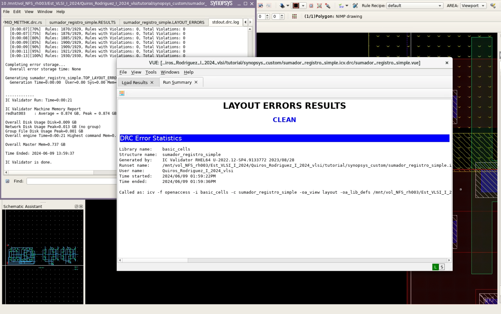

# Tarea_4_vlsi
Esteicy Jazmín Faerron Durán - Andrew José Quirós Rodríguez

## Introducción
En este proyecto se diseñará un contador arriba-abajo de 8 bits con carga
paralela, con reset asincrónico, que pueda correr al menos a 100 MHz.

## Caracterización de sumador y FF

Para esta primera parte, se obtienen los parámetros de de tiempo de propagación y consumo de potencia del sumador completo FAHDLLX0 y FF DFRRHDLLX0. El esquemático del sumador se ve de la siguiente forma:

El del FF se ve de la siguiente forma:

Una vez obtenido los esquemáticos, se debe realizar un ciruito de prueba para poder medir los tiempos de propagación del sumador.

Con este circuito, es posible observar las señales de entrada y salida del sumador.

Del cual se puede medir los tiempos de propagación tanto para la salida S como el bit de acarreo Cout respectivamente.

$t_{pd_S} = 816 ps$

$t_{pd_{Cout}} = 522 ps$

Se necesita que el tiempo de propagación de la salida Cout sea menor porque los bits más significativos dependen de este valor para sus sumas, por lo que debe terminar antes. 

Para la obtención del consumo de potencia de este componente se observa la información de la hoja de datos de la energía consumida del sumador y el FF respectivamente:

En el cual se tiene L como la carga de salida en pf. Para esta prueba se tiene una carga de salida de 5 fF, lo que da 0.005 pF. Además, como la unidad resultante es [uW/MHz], se debe multiplicar la frecuencia con la que se va a estar trabajando para finalmente obtener la potencia dinámica del sistema. La frecuencia en este caso se trata de 100 MHz.

$P_{sumador} = (0.10209+6.47991*0.005)*100*2 = 13.44*2  = 26.88 \mu W$

$P_{registro} = (0.13894+6.47978*0.005)*100 = 17.13389 \mu W$

$P_{registro8bits} = 17.13389*8 = 137.07112 \mu W$

## Trazado del sumador de 1 bit con registro

Antes de avanzar con el contador de 8 bits. Se debe hacer un trazado donde se conecte el sumador completo de 1 bit con un registro de 1 bit. El esquemático de la conexión de estos se ve de la siguiente manera:

El cual se le realiza el trazado para la extracción de capacitancias parasitarias. El trazado resultante se observa a continuación:

Para comprobar el correcto trazado del circuito, se debe hacer una prueba DRC para revisar que se cumplan todas las reglas físicas del trazado.

